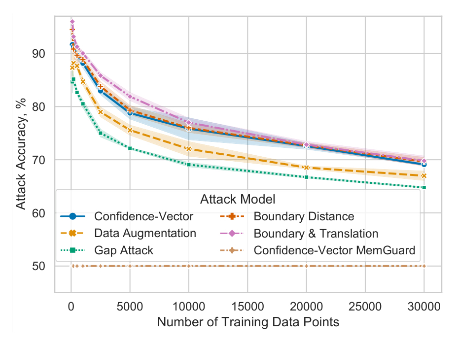
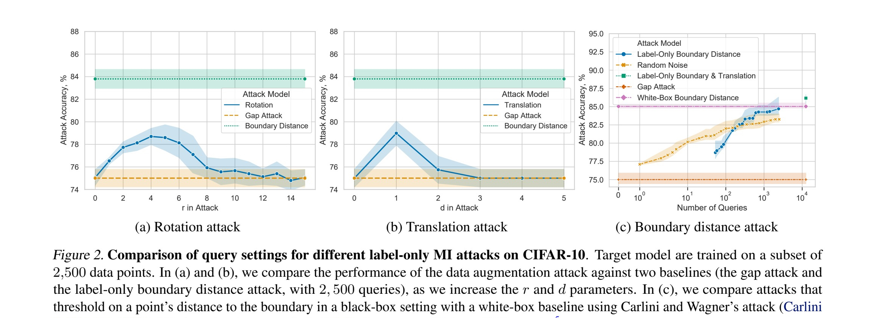
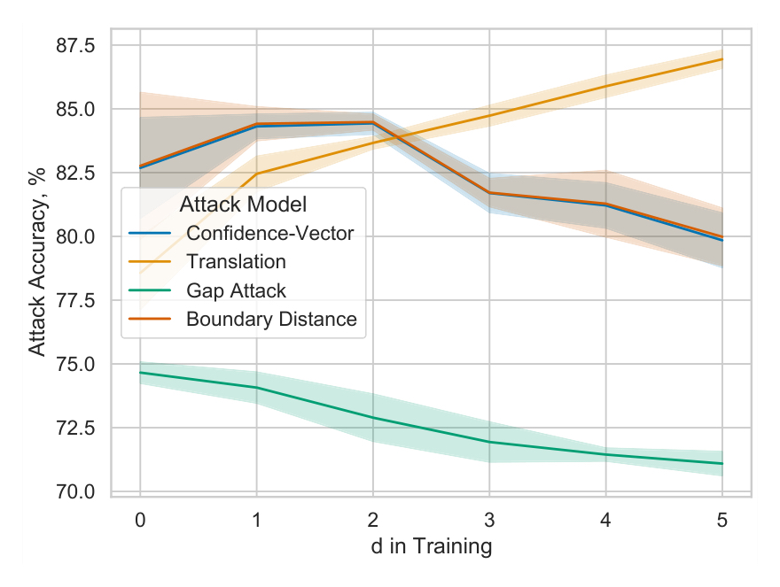
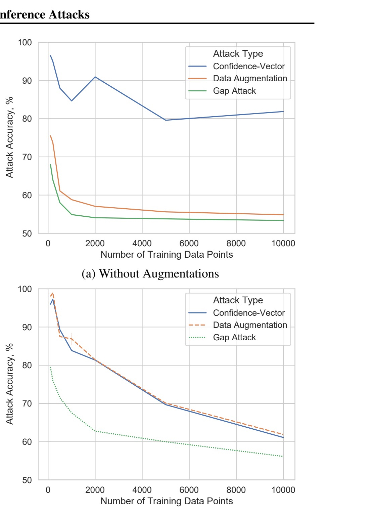
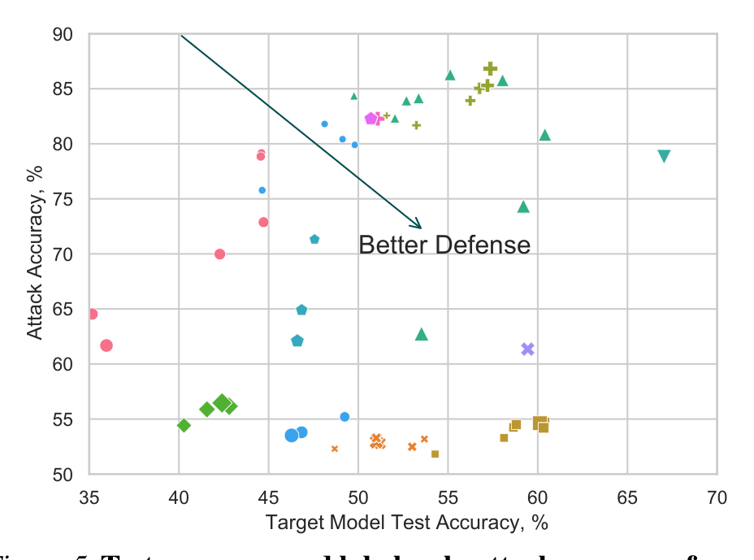
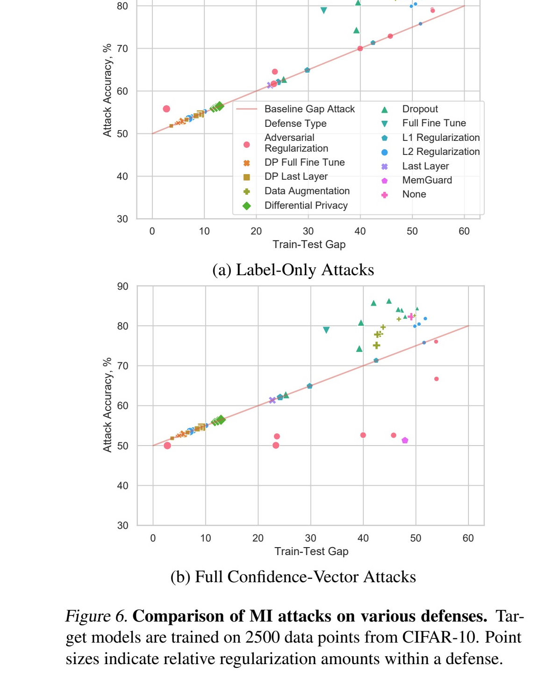

# Label-Only Membership Inference Attacks

Christopher A. Choquette-Choo^1^, Florian Tramèr^2^, Nicholas Carlini^3^, Nicolas Papernot^1^

^1^ University of Toronto and Vector Institute  
^2^ Stanford University  
^3^ Google

Correspondence to: Christopher A. Choquette-Choo `<choquette.christopher@gmail.com>`

*Proceedings of the 38th International Conference on Machine Learning, PMLR 139, 2021. Copyright 2021 by the author(s).*

<!-- source-page: 1 -->

## Abstract

Membership inference is one of the simplest privacy threats faced by machine learning models that are trained on private sensitive data. In this attack, an adversary infers whether a particular point was used to train the model, or not, by observing the model's predictions. Whereas current attack methods all require access to the model's predicted confidence score, we introduce a label-only attack that instead evaluates the robustness of the model's predicted (hard) labels under perturbations of the input, to infer membership. Our label-only attack is not only as effective as attacks requiring access to confidence scores, it also demonstrates that a class of defenses against membership inference, which we call "confidence masking" because they obfuscate the confidence scores to thwart attacks, are insufficient to prevent the leakage of private information. Our experiments show that training with differential privacy or strong `l2` regularization are the only current defenses that meaningfully decrease leakage of private information, even for points that are outliers of the training distribution.

## 1. Introduction

Machine learning algorithms are often trained on sensitive or private user information, e.g., medical records (Stanfill et al., 2010), conversations (Devlin et al., 2018), or financial information (Ngai et al., 2011). Trained models can inadvertently leak information about their training data (Shokri et al., 2016; Carlini et al., 2019), violating users' privacy.

In perhaps the simplest form of information leakage, *membership inference* (MI) (Shokri et al., 2016) attacks enable an adversary to determine whether or not a data point was used in the training data. Revealing just this information can cause harm: it leaks information about specific individuals instead of the entire population. Consider a model trained to learn the link between a cancer patient's morphological data and their reaction to some drug. An adversary with a victim's morphological data and query access to the trained model cannot directly infer if the victim has cancer. However, inferring that the victim's data was part of the model's training set reveals that the victim indeed has cancer.

Existing MI attacks exploit the higher confidence that models exhibit on their training data (Pyrgelis et al., 2017; Truex et al., 2018; Hayes et al., 2019; Salem et al., 2018). An adversary queries the model on a candidate data point to obtain the model's confidence and infers the candidate's membership in the training set based on a decision rule. The difference in prediction confidence is largely attributed to *overfitting* (Shokri et al., 2016; Yeom et al., 2018).

A large body of work has been devoted to understanding and mitigating MI leakage in ML models. Existing defense strategies fall into two broad categories and either:

1. reduce overfitting (Truex et al., 2018; Shokri et al., 2016; Salem et al., 2018), or
2. perturb a model's predictions so as to minimize the success of known membership attacks (Nasr et al., 2018a; Jia et al., 2019; Yang et al., 2020).

Defenses in (1) use regularization techniques or increase the amount of training data to reduce overfitting. In contrast, the adversary-aware defenses of (2) explicitly aim to minimize the MI advantage of a particular attack. They do so either by modifying the training procedure (e.g., an additional loss penalty) or the inference procedure after training. These defenses implicitly or explicitly rely on a strategy that we call *confidence-masking*, where the MI signal in the model's confidence scores is masked to thwart existing attacks.

We introduce *label-only MI attacks*. Our attacks are more general: an adversary need only obtain (hard) labels, without prediction confidences, of the trained model. This threat model is more realistic, as ML models deployed in user-facing products need not expose raw confidence scores. Thus, our attacks can be mounted on any ML classifier.[^1]

<!-- source-page: 2 -->

In the label-only setting, a naive baseline predicts misclassified points as non-members. Our focus is surpassing this baseline. To this end, we will have to make *multiple* queries to the target model. We show how to extract fine-grained MI signal by analyzing a model's robustness to perturbations of the target data, which reveals signatures of its decision boundary geometry. Our adversary queries the model for predicted labels on augmentations of data points (e.g., translations in vision domains) as well as adversarial examples.

We make the following contributions. In Section 5.1, we introduce the first label-only attacks, which match confidence-vector attacks. By combining them, we outperform all others. In Sections 5.2, 5.3, and 5.4, we show that confidence masking is not a viable defense to privacy leakage, by breaking two canonical defenses that use "MemGuard" and Adversarial Regularization. In Section 6, we evaluate two additional techniques to reduce overfitting: data augmentation and transfer learning. We find that data augmentation can worsen MI leakage while transfer learning can mitigate it. In Section 7, we introduce "outlier MI": a stronger property that defenses should satisfy to protect MI of worst-case inputs; adversarially private training and (strong) `L2` regularization appear to be the only effective defenses. Our code is available at `https://github.com/choquette/membership-inference`.

## 2. Background and Related Works

Membership inference attacks (Shokri et al., 2016) are a form of privacy leakage that identify if a given data sample was in a machine learning model's training dataset. Given a sample `x` and access to a trained model `h`, the adversary uses a classifier or decision rule `f` to compute a membership prediction `f(x; h) in {0, 1}`, with output `1` iff `x` is a training point. The main challenge in mounting a MI attack is creating the attack classifier `f`, under various assumptions about the adversary's knowledge of `h` and its training data distribution. Most prior work assumes that an adversary has only black-box access or white-box access to the trained model `h`, via a query interface that on input `x` returns part or all of the confidence vector `h(x) in [0,1]^C` (for a classification task with `C` classes).

The attack classifier `f` is often trained on a local shadow (or, source) model `h_s`, which is trained on the same (or a similar) distribution as `h`'s training data. Because the adversary trained `h_s`, they can assign membership labels to any input `x`, and use this dataset to train `f`. Salem et al. (2018) later showed that this strategy succeeds even when the adversary only has data from a different, but similar, task and that shadow models are unnecessary: a threshold predicting `f(x; h) = 1` when the max prediction confidence, `max_y h_y(x)`, is above a tuned threshold, suffices.

Yeom et al. (2018) investigate how querying related inputs `x'` to `x` can improve MI. Song et al. (2019) explore how models explicitly trained to be robust to adversarial examples can become more vulnerable to MI (similar to our analysis of data augmentation in Section 6). Both works are crucially different because they use a different attack methodology and assume access to confidence scores. Sablayrolles et al. (2019) demonstrate that black-box attacks (like ours) can approximate white-box attacks by effectively estimating the model loss for a data point. Refer to Appendix A for a detailed background, including on defenses.

## 3. Attack Model Design

Our proposed MI attacks improve on existing attacks by (1) combining multiple strategically perturbed samples (queries) as a fine-grained signal of the model's decision boundary, and (2) operating in a label-only regime. Thus, our attacks pose a threat to any query-able ML service.

### 3.1. A Naive Baseline: The Gap Attack

Label-only MI attacks face a challenge of granularity. For any query `x`, our attack model's information is limited to only the predicted class-label, `y = argmax_y h(x)`. A simple *baseline* attack (Yeom et al., 2018) that predicts any misclassified data point as a non-member of the training set is a useful benchmark to assess the extra (non-trivial) information that MI attacks, label-only or otherwise, can extract. We call this baseline the *gap attack* because its accuracy is directly related to the gap between the model's accuracy on training data (`acc_train`) and held out data (`acc_test`):

$$
\frac{1}{2} + \frac{(acc_{train} - acc_{test})}{2}.
$$

To exploit additional leakage on top of this baseline attack (where non-trivial MI), any label-only adversary must necessarily make additional queries to the model. To the best of our knowledge, this trivial baseline is the only attack proposed in prior work that uses only the predicted label, `y = argmax_y h(x)`.

### 3.2. Attack Intuition

Our strategy is to compute label-only "proxies" for the model's confidence by evaluating its robustness to strategic input perturbations `x + r`, either synthetic (i.e., data augmentation) or adversarial (Szegedy et al., 2013). Following a max-margin perspective, we predict that data points that exhibit high robustness are training data points. Works in the adversarial example literature share a similar perspective that non-training points are closer to the decision boundary and thus more susceptible to perturbations (Tanay & Griffin, 2016; Tian et al., 2018; Hu et al., 2019).

Our intuition for leveraging robustness is two-fold. First, distance to the decision boundary can be a proxy for confidence, from linear models to deep neural networks. Recall that confidence-thresholding attacks predict highly confident samples as members (Salem et al., 2018). Given some estimate `dist(x, y)` of a point's `ell2`-distance to the model's boundary, we predict a member if `dist(x, y) > tau` for some threshold `tau`. We define `dist(x, y) = 0` for misclassified points, where `argmax_y h(x') != y`, because no perturbation was needed. We tune `tau` on a shadow model, and find that even crude estimates, e.g., Gaussian noise, can lead to nearly comparable attacks (see Section 5.5).

<!-- source-page: 3 -->

### 3.3. Data Augmentation

Our data augmentation attacks create a MI classifier `f(x; h)` for a model `h`. Given a target point `(x_0, y_true)`, the adversary trains `f` to output `f(x_0, h) = 1` if `x_0` was a training member. To do this, they tune `f` to maximize MI accuracy on a source ("shadow") model assuming knowledge of the target model's architecture and training data distribution. They then "transfer" `f` to perform MI by querying the black-box model `h`. Using `x_0`, we create additional data points `{x_1, ..., x_N}` via different data augmentation strategies. We query the target model `h` in tuning to obtain labels `y_i`, where `y_i = argmax_y h(x_i)`. Let `b_i <- 1{y_true = y_i}` be the indicator function for whether the `i`-th queried point was misclassified. Finally, we apply `f(b_0, ..., b_N) -> {0,1}` to classify `x_0`.

We experiment with two common data augmentations in the computer vision domain: image rotations and translations. For rotations, we generate `N = 3` images as rotations by a magnitude `+-r` for `r in [1,15]`. For translations, we generate `N = 4d + 1` translated images satisfying a pixel bound `d`, where horizontal shift by `+-i` and vertical shift by `+-j`. In both we include the source image.

### 3.4. Decision Boundary Distance

These attacks predict membership using a point's distance to the model's decision boundary. For models not trained using augmentation, their robustness to perturbations can still be a proxy for model confidence. Given the special case of (binary) logistic regression models, with a learned weight vector `w` and bias `b`, the model will output a confidence score for the positive class of the form:

$$
h(x) = \sigma(w^T x + b), \quad \sigma(t) = \frac{1}{1 + e^{-t}}.
$$

Here, there is a monotone relationship between the confidence at `x` and the Euclidean distance to the model's decision boundary. This distance is:

$$
\frac{w \cdot x + b}{||w||_2} = \frac{\sigma^{-1}(h(x))}{||w||_2}.
$$

Thus, obtaining a point's distance to the boundary yields the same information as the confidence score. Computing this distance is exactly the problem of finding the smallest *adversarial perturbation*, which can be done using label-only access to a classifier (Brendel et al., 2017; Chen et al., 2019). Our thesis is that this relationship is supported by prior work that suggests deep neural networks can be closely approximated by linear functions in the vicinity of the data (Goodfellow et al., 2014).

#### A White-Box Baseline

For estimating `dist(x, y)` we can use adversarial-example attacks developed for the Carlini and Wagner attack (Carlini & Wagner, 2017): given `(x, y)` the attack tries to find the closest point `x'` to `x` in the Euclidean norm, such that `argmax_y h(x') != y`.

#### Label-only attacks

In label-only attacks we only assume black-box access. We rely on label-only adversarial example attacks (Brendel et al., 2017; Chen et al., 2019). These attacks start from a random point `x'` that is misclassified, i.e., `h(x') != y`. They then "walk" along the boundary while minimizing the distance to `x`. We use "HopSkipJump" (Chen et al., 2019), which closely approximates stronger white-box attacks.

#### Robustness to random noise

Robustness to random noise is a simpler approach based on random perturbations. Again, our intent stems from linear models: a point's distance to the boundary is directly related to the model's accuracy under noise, perturbed by isotropic Gaussian noise (Ford et al., 2019). We compute a proxy for `dist(x, y)` by evaluating the accuracy of `h` on `N` points `x_i = x + N(0, sigma^2 I)`, where `sigma` is tuned on `h`. For binary features we instead use Bernoulli noise: each `x_j in x` is flipped with probability `p`, which is tuned on `h`.

Many signals for robustness can be combined to improve the attack performance. We evaluate `dist(x, y)` for augmentations `x'` from Section 3.3. We only evaluate this attack where indicated due to its high query cost (see Section 5.5).

<!-- source-page: 4 -->

## 4. Evaluation Setup

Our evaluation is aimed at understanding how label-only MI attacks compare with prior attacks that rely on access to a richer query interface. To this end, we use an *identical evaluation setup* as prior works (Nasr et al., 2018b; Shokri et al., 2016; Long et al., 2017; Truex et al., 2018; Salem et al., 2018) (see Appendix B). We answer the following questions in our evaluation, Sections 5, 6, and 7:

1. Can label-only MI attacks match prior attacks that use the model's (full) confidence vector?
2. Are defenses against confidence-based MI attacks always effective against label-only attacks?
3. What is the query complexity of label-only attacks?
4. Which defenses prevent both label-only and full confidence-vector attacks?

To evaluate an attack's success, we pick a balanced set of points from the task distribution, of which half come from the target model's training set. We measure attack success as overall MI accuracy but find `F1` scores to approximately match, with near `100%` recall. See Supplement B.2 for further discussion on this evaluation.

Overall, we stress that our main goal is to show that *in settings where MI attacks have been shown to succeed, a label-only query interface is sufficient*. In general, we should not expect our label-only attacks to exceed the performance of prior MI attacks since the former uses strictly less information from queries than the latter. There are three notable exceptions: our combined attack (Section 5.1), "confidence masking" defenses (Section 5.2), and models trained with significant data augmentation (Section 6.1). In the latter two cases, we find that existing attacks severely underestimate MI.

### 4.1. Attack Setup

We provide a detailed account of model architectures and training procedures in Supplement B.1 and of our threat model in Supplement C. We evaluate our attacks on 8 datasets used by the canonical work of Shokri et al. (2016). These include 3 computer vision tasks,[^2] which are our main focus because of the importance of data augmentation to them, and 4 non-computer-vision tasks[^3] to showcase our attacks' transferability. We train target neural networks on subsets of the original training data, exactly as performed by Shokri et al. (2016) and several later works (in both data amount and train-test gap). Controlling the training set size lets us control the amount of overfitting the model exhibits. Prior work has almost exclusively studied (confidence-based) MI attacks on these small datasets where models exhibit a high degree of overfitting. Recall that our goal is to show that label-only attacks match confidence-based approaches: scaling MI attacks (whether confidence-based or label-only) to larger training datasets is an important area of future work.

## 5. Evaluation of Label-Only Attacks

### 5.1. Label-Only Attacks Match Confidence-Vector Attacks

We first focus on question 1). Recall from Section 3.1 that any label-only attack (with knowledge of `y`) is always trivially lower-bounded by the baseline gap attack of Yeom et al. (2018), predicting any misclassified point as a non-member.

Our main result is that our label-only attacks consistently outperform the gap attack and perform on-par with prior confidence-vector attacks; by combining attacks, we can even surpass the canonical confidence-vector attacks.

Observing Figure 1 and Table 1 (a) and (c), we see that the confidence-vector attack outperforms the baseline gap attack, demonstrating that it exploits non-trivial MI. Remarkably, we find that our *label-only boundary distance attack* performs at least on-par with the confidence-vector attack. Moreover, our simple but more query efficient (see Section 5.5) data augmentation attacks also consistently outperform the baseline but fall short of the confidence-vector attacks. Finally, combining these two label-only attacks, we can consistently outperform every other attack. Hence, models were not trained with data augmentation; in Section 6.1, we find that when they are, our data augmentation attacks outperform all others. Finally, we verify that as the training set size increases, all attacks monotonically decrease because the train-test gap is reduced. Note that on CIFAR-100, we experiment with the largest training subset possible: 30,000 data points, since we use the other half as the source model training set (and target model non-members).

Beyond images, we show that our label-only attacks can be applied outside of the image domain in Table 2. Our label-only attack evaluates a model's accuracy under *random perturbations*, by adding Gaussian noise for continuous-valued inputs, and flipping binary values according to Bernoulli noise (see Section 3.4). Using 10,000 queries, our attacks closely match (at most 4 percentage-point degradation) confidence-based attacks. Note that our attacks could also be instantiated in audio or natural language domains, using existing adversarial examples attacks (Carlini & Wagner, 2018) and data augmentations (Zhang et al., 2015).

*Figure 1. Accuracy of MI attacks on CIFAR-10. We evaluate 100 to 10,000 training points and compare the baseline gap attack, the confidence-vector attack that relies on a fine-grained query interface, and our label-only attacks based on data augmentation and distance to the decision boundary. We also show the confidence-vector attack performance against MemGuard, noting that our label-only performances remain nearly unaltered. For the data augmentation attack, we report the best accuracy across multiple values of `r` (rotation angle) and `d` (number of translated pixels).*

**Table 1. Accuracy of MI attacks on CIFAR-100 and MNIST.** The target models are trained using 30,000 data points for CIFAR-100 and 1,000 for MNIST. Results affected by confidence masking are bolded here; in the original PDF they are marked in red. "Combined" refers to the boundary and translation attack.

| Attack | CIFAR-100 Undefended | CIFAR-100 MemGuard | MNIST Undefended | MNIST MemGuard |
| --- | ---: | ---: | ---: | ---: |
| Gap attack | 83.5 | 83.5 | 53.2 | 53.2 |
| Confidence-vector | 88.1 | **50.0** | 55.7 | **50.0** |
| Data augmentation | 84.6 | 84.6 | 53.9 | 53.9 |
| Boundary distance | 88.0 | 88.0 | 57.8 | 57.8 |
| Combined | 89.2 | 89.2 | 58.7 | 58.7 |

### 5.2. Breaking Confidence Masking Defenses

Answering question 2), we showcase an example where our label-only attacks *outperform* prior attacks by a significant margin, despite the strictly more restricted query interface that they assume. We evaluate defenses against MI attacks and show that while these defenses do protect against existing confidence-vector attacks, they have little to no effect on our label-only attacks. Because any ML classifier providing confidences also provides the predicted labels, our attacks fall within their threat model, refuting these defenses' security claims.

We identify a common pattern to these defenses that we call *confidence masking*, wherein defenses aim to prevent MI by directly minimizing the privacy leakage in a model's confidence scores. To this end, confidence-masking defenses explicitly or implicitly mask (or, obfuscate) the information contained in the model's confidences, e.g., by adding noise to thwart existing attacks. These defenses, however, have a minimal effect on the model's predicted labels. MemGuard (Jia et al., 2019) and prediction purification (Yang et al., 2020) explicitly maintain the invariant that the model's predicted labels are not affected by the defense, i.e.,

$$
\forall x,\; argmax_y\; h(x) = argmax_y\; h^{defense}(x),
$$

where `h^{defense}` is the defended version of the model `h`.

An immediate issue with the design of confidence-masking defenses is that, by construction, they will not prevent any label-only attack. Yet, these defenses were reported to drive the success rates of existing MI attacks to within chance. This result suggests that prior attacks fail to properly extract membership information contained in the model's predicted labels, and implicitly contained within its scores. Our label-only attack performances clearly indicate that confidence masking is not a viable defense strategy against MI.

We show that two peer-reviewed defenses, MemGuard (Jia et al., 2019) and adversarial regularization (Nasr et al., 2018), fail to prevent label-only attacks, and thus do not significantly reduce MI compared to an undefended model. Other proposed defenses, e.g., reducing the precision or cardinality of the confidence-vector (Shokri et al., 2016; Truex et al., 2018; Salem et al., 2018), and recent defenses like prediction purification (Yang et al., 2020), also rely on confidence masking: they are unlikely to resist label-only attacks. See Supplement D for more details on these defenses.

<!-- source-page: 5 -->

### 5.3. Breaking MemGuard

We implement the strongest version of MemGuard that can make arbitrary changes to the confidence-vector while leaving the model's predicted label unchanged. Observing Figure 1 and Table 1 (b) and (d), we see that MemGuard successfully defends against prior confidence-vector attacks, but as expected, offers no protection against our label-only attack. All our attacks significantly outperform the (non-adaptive) confidence-vector and the baseline gap attack.

The main reason that label-only MI works against MemGuard is because these attacks were not properly adapted to this defense. Specifically, MemGuard is evaluated against confidence-vector attacks that are tuned on source models not under *MemGuard enabled*. This observation also holds for other defenses such as Yang et al. (2020). Thus, the attacks' membership predictors are tuned to distinguish members from non-members based on high confidence scores, which these defenses obfuscate. In a sense, a label-only attack like ours is the "right" adaptive attack against these defenses: since the model's confidence scores are no longer reliable, the adversary's best strategy is to use hard labels, which these defenses explicitly do not modify.

Moving forward, we recommend that the trivial gap baseline serve as an indicator of confidence masking: a confidence-vector attack should not perform significantly worse than the gap attack for a defense to protect against MI. Thus, to protect against (all) MI attacks, a defense cannot solely post-process the confidence-vector, the model will still be vulnerable to label-only attacks.

<!-- source-page: 6 -->

**Table 2. Accuracy of membership inference attacks on Texas, Purchase, Location, and Adult.** Where augmentations may not exist, noise robustness can still perform on or near par with confidence-vector attacks. The target models are trained exactly as in Shokri et al. (2016): 1,600 points for Location and 10,000 for the rest. Results affected by confidence masking are bolded here; in the original PDF they are marked in red.

| Attack | Texas | Texas MemGuard | Purchase | Purchase MemGuard | Location | Location MemGuard | Adult | Adult MemGuard |
| --- | ---: | ---: | ---: | ---: | ---: | ---: | ---: | ---: |
| Gap attack | 73.9 | 73.9 | 67.1 | 67.1 | 72.1 | 72.1 | 58.7 | 58.7 |
| Confidence-vector | 84.0 | **50.0** | 86.1 | **50.0** | 92.6 | **50.0** | 59.9 | **50.0** |
| Noise robustness | 80.3 | 80.3 | 87.4 | 87.4 | 89.2 | 89.2 | 58.7 | 58.7 |

### 5.4. Breaking Adversarial Regularization

The work of Nasr et al. (2018a) differs from MemGuard and prediction purification in that it does not simply obfuscate confidence vectors at test time. Rather, it jointly trains a target model and a defensive confidence-vector MI classifier in a min-max fashion: the attack model to maximize MI and the target model to produce accurate outputs that yet fool the attacker. See Supplement D for more details.

We train a target model defended using adversarial regularization, exactly as in Nasr et al. (2018a). By varying its hyper-parameters, we achieve a defended state where the confidence-vector attack is within 3 percentage points of chance, as shown in Supplement Figure 9. Again, our label-only attacks significantly outperform this attack (compare Figures 6(a) and 6(b)) because the train-test gap is only marginally reduced; this defense is not entirely ineffective, it prevents label-only attacks from exploiting beyond 3 percentage points of the gap attack. However, when label-only attacks are sufficiently defended, it achieves significantly worse test-accuracy trade-offs than other defenses (see Figure 5). And yet, evaluating the defense solely on confidence-vector attacks overestimates the achieved privacy.

### 5.5. The Query Complexity of Label-Only Attacks

We now answer question 3) and investigate how the query budget affects the success rate of different label-only attacks.

Recall that our rotation attack evaluates `N = 3` queries of images rotated by `r` and our translation attack `N = 4d + 1` images satisfying a total displacement `d`. Figure 2(a)-(b) shows that there is a range of perturbation magnitudes for which the attack exceeds the baseline (i.e., `1 <= r <= 8` for rotations, and `1 <= d <= 2` for translations). When the augmentations are too small or too large, the attack performs poorly because the augmentations have a similar effect on both train and test samples (i.e., small augmentations rarely change model predictions and large augmentations often cause misclassifications). An optimal parameter choice (`r` and `d`) outperforms the baseline by 3-4 percentage points, which an adversary can tune using its local source model. As we will see in Section 6, these attacks outperform all others on models that used data augmentation at training time.

In Figure 2(c), we compare different boundary distance attacks, discussed in Section 3.4. With approximately `2,500` queries, the label-only attack matches the white-box upper-bound using approximately `2,000` queries and also matches the best confidence-vector attack (see Figure 1). With approximately `12,500` queries, our combined attack can outperform all others. Sybil attacks (Doucet, 2002) can circumvent the trivial gap by 4 percentage points. Finally, at fewer than `300` queries, our simple noise robustness attack outperforms our other label-only attacks. At large query budgets, our boundary distance attack produces more precise distance estimates and outperforms it. Note that the monetary costs are modest at approximately `$0.25` per sample.[^4]

<!-- source-page: 7 -->

*Figure 2. Comparison of query settings for different label-only MI attacks on CIFAR-10. Target models are trained on a subset of 2,500 data points. In (a) and (b), we compare the performance of the data augmentation attack against two baselines (the gap attack and the label-only boundary distance attack, with 2,500 queries), as we increase the `r` and `d` parameters. In (c), we compare attacks that threshold on a point's distance to the boundary in a black-box setting with a white-box baseline using Carlini and Wagner's attack (Carlini & Wagner, 2017). We describe these attacks in Section 3.4. Costs are approximately `$0.1` per 1000 queries.*

## 6. Defending with Better Generalization

Since confidence-masking defenses cannot robustly defend against MI attacks, we now investigate to what extent standard regularization techniques, that aim to limit a model's ability to overfit to its training set, can defend membership inference. We study how data augmentation, transfer learning, dropout (Srivastava et al., 2014), `l1/l2` regularization, and differential privacy (Abadi et al., 2016) impact MI.

We explore three questions in this section:

- A. How does training with data augmentation impact MI attacks, especially those that evaluate augmented data?
- B. How well do other standard machine learning regularization techniques help in reducing MI?
- C. How do these defenses compare to differential privacy, which can provide formal guarantees against any form of membership leakage?

### 6.1. Training with Data Augmentation Exacerbates MI

Data augmentation is commonly used in machine learning to reduce overfitting and encourage generalization, especially in low data regimes (Shorten & Khoshgoftaar, 2019; Mikolajczyk & Grochowski, 2018). Data augmentation is an interesting case study for our attacks. As it reduces the model's overfitting, one would expect it to reduce MI. But, a model trained with augmentation will have been trained to strongly recognize `x` and its augmentations, which is precisely the signal that our data augmentation attacks exploit.

We train target models with data augmentation similar to Section 3.3 and focus on translations as they are most common in computer vision. We use a simple pipeline where all translations of each image is evaluated in a training epoch. Though this differs slightly from the standard random sampling, we choose to illustrate the maximum MI when the adversary's queries exactly match the samples seen in training.

Observe from Figure 3 that augmentation reduces overfitting and improves generalization: test accuracy increases from `49.7%` without translations to `58.7%` at `d = 5` and the train-test gap decreases. Due to improved generalization, the confidence-vector and boundary distance attacks' accuracies decrease. Yet, the success rate of the data augmentation attack increases. This increase confirms our initial intuition that the model now leaks *additional* membership information via its invariance to training-time augmentation. Though the model trained with `d = 5` pixel shifts has higher test accuracy, our data augmentation attack exceeds the confidence-vector performance on the non-augmented model. Thus, model generalization is not the only variable affecting its membership leakage: models that overfit less on the original data may actually be more vulnerable to MI because they *implicitly overfit more on related data*.

**Attacking a high-accuracy ResNet.** We use, without modification, the pipeline from FixMatch (Sohn et al., 2020), which trains a ResNet-28 to `96%` accuracy on the CIFAR-10 dataset, comparable to the state of the art. As with our other experiments, this model is trained using a subset of CIFAR-10, which sometimes leads to observably overfit models indicated by a higher gap attack accuracy. We train models using four regularizations, all random: vertical flips, shifts by up to `d = 4` pixels, image cutout (DeVries & Taylor, 2017), and (non-random) weight decay of magnitude `0.0005`. All are either enabled or disabled.

Our results here, shown in Figure 4, corroborate those above. Though we find in Supplement Figure 8 that the attack is strongest when the adversary correctly guesses `d`, we note that these values are often fixed for a domain and image resolution. Thus, adversarial knowledge of the augmentation pipeline is not a strong assumption.[^5]

<!-- source-page: 8 -->

*Figure 3. Accuracy of MI attacks on CIFAR-10 models trained with data augmentation on a subset of 2500 images. As in our attack, `d` controls the number of pixels by which images are translated during training, where no augmentation is `d = 0`. For models trained with significant amounts of data augmentation, MI attacks become stronger despite it generalizing better.*

*Figure 4. Accuracy of membership inference attacks on CIFAR-10 models trained as in FixMatch (Sohn et al., 2020). Our data augmentation attacks, which mimic the training augmentations, match or outperform the confidence-vector attacks when augmentations were used in training. We evaluate 1000 randomly generated augmentations for this attack. As in previous experiments, we find our label-only distance attack performs on par with the confidence-vector attack. Interestingly, the gap attack accuracy also improves due to a relatively larger increase in training accuracy. "With Augmentations" and "Without Augmentations" refer to using all regularizations, as in FixMatch, or none, respectively.*

### 6.2. Other Techniques to Prevent Overfitting

We explore questions B)-C) using other standard regularization techniques, with details in Supplement E. In transfer learning, we either only train a new last layer (*last layer fine-tuning*), or fine tune the entire model (*full fine-tuning*). We pre-train a model on CIFAR-100 to `51.6%` test accuracy and then use transfer learning. We find that boundary distance attack performed on par with the confidence-vector in all cases. We observe that last layer fine-tuning degrades all our attacks to the generalization gap, preventing non-trivial MI (see Figure 10 in Supplement F). This result corroborates intuition: linear layers have less capacity to overfit compared to neural networks. We observe that full fine-tuning leaks more membership inference but achieves better test accuracies, as shown in Figure 5.

Finally, DP training (Abadi et al., 2016) formally enforces that the trained model does not strongly depend on any individual training point, hence it does not overfit. We use differential privacy gradient descent (DP-SGD) (Abadi et al., 2016). To achieve comparable test accuracies as undefended models, the formal privacy guarantees become mostly meaningless (i.e., `epsilon > 100`).

In Figure 6, we find that most forms of regularization fail to prevent even the baseline gap attack from reaching `60%` accuracy or more. Only strong `l2` regularization (`lambda >= 1`) and DP training consistently reduced MI. Figure 5 gives us a best understanding of the privacy-utility trade-off. We see that both prevent MI at a high cost in test-accuracy, they cause the model to *underfit*. However, we also clearly see the utility benefits of transfer learning: these models achieve consistently better test-accuracy due to features learned from non-private data. Combining DP training with transfer learning mitigates privacy leakage at only minimal cost in test accuracy, achieving the best tradeoff. When transfer learning is not an option, dropout performs better.

## 7. Worst-Case (Outlier) MI

Here, we perform MI only for a small subset of "outliers". Even if a model generalizes well on average, it might still have overfit to unusual data in the tails of the distribution (Carlini et al., 2019). We use a similar but modified process as Long et al. (2018) to identify potential outliers.

First, the adversary uses a source model `h_hat` to map each targeted data point, `x`, to its feature space, or the activations of its penultimate layer, denoted as `z(x)`. We define two points `x_1, x_2` as neighbors if their features are close, i.e., `d(z(x_1), z(x_2)) <= delta`, where `d(., .)` is the cosine distance and `delta` is a tunable parameter. An outlier is a point with less than `gamma` neighbors in `z(x)` where `gamma` is another tunable parameter. Given a dataset `X` of potential targets and an intended fraction of outliers `beta` (e.g., `1%` of `X`), we tune `delta` and `gamma` so that a `beta`-fraction of points in `X` are outliers. We use precision as the MI success metric.

We run our attacks on the outliers of the same models as in Figure 6. We find in Supplement Figure 11 that we can always improve the attack by targeting outliers, but that strong `L2` regularization and DP training prevent MI. As before, we find that the label-only boundary distance attack matches the confidence-vector attack performance.

<!-- source-page: 9 -->

*Figure 5. Test accuracy and label-only attack accuracy for various defenses. Same setup as Figure 6. Models towards the bottom right are more private and more accurate.*

*Figure 6. Comparison of MI attacks on various defenses. Target models are trained on 2500 data points from CIFAR-10. Point sizes indicate relative regularization amounts within a defense.*

## 8. Conclusion

We developed three new label-only membership inference attacks that can match, and even exceed, the success of prior confidence-vector attacks, despite operating in a more restricted adversarial model. Their label-only nature requires fundamentally different attack strategies, that in turn cannot be trivially prevented by obfuscating a model's confidence scores. We have used these attacks to break two state-of-the-art defenses to membership inference attacks.

We have found that the problem with these "confidence-masking" defenses runs deeper: they cannot prevent any label-only attack. As a result, any defenses against MI necessarily have to reduce a model's train-test gap.

Finally, via a rigorous evaluation across many proposed defenses to MI, we have shown that differential privacy with transfer learning provides the strongest defense, both in an average-case and worst-case sense, but that it may come at a cost in the model's test accuracy.

To center our analysis on comparing the confidence-vector and label-only settings, we use the same threat model as prior work (Shokri et al., 2016) and leave a fine-grained analysis of label-only attacks under reduced adversarial knowledge (e.g., reduced data and model architecture knowledge) to future work.

## Acknowledgments

We thank the reviewers for their insightful feedback. This work was supported by CIFAR (through a Canada CIFAR AI Chair), by NSERC (under the Discovery Program, NFRF Exploration program, and COHESA strategic research network), and by gifts from Intel and Microsoft. We also thank the Vector Institute's sponsors.

<!-- source-page: 10 -->

## References

Abadi, M., Chu, A., Goodfellow, I., McMahan, H. B., Mironov, I., Talwar, K., and Zhang, L. *Deep learning with differential privacy.* In *Proceedings of the 2016 ACM SIGSAC Conference on Computer and Communications Security*, CCS '16, pp. 308-318, New York, NY, USA, 2016. Association for Computing Machinery. ISBN 9781450341394. doi: `10.1145/2976749.2978318`.

Bengio, Y., Goodfellow, I., and Courville, A. *Deep learning*, volume 1. MIT Press, 2017.

Brendel, W., Rauber, J., and Bethge, M. *Decision-based adversarial attacks: Reliable attacks against black-box machine learning models.* `arXiv preprint arXiv:1712.02428`, 2017.

Carlini, N. and Wagner, D. *Towards evaluating the robustness of neural networks.* In 2017 IEEE Symposium on Security and Privacy (sp), pp. 39-57. IEEE, 2017.

Carlini, N. and Wagner, D. *Audio adversarial examples: Targeted attacks on speech-to-text.* In 2018 IEEE Security and Privacy Workshops (SPW), pp. 1-7. IEEE, 2018.

Carlini, N., Liu, C., Erlingsson, U., Kos, J., and Song, D. *The secret sharer: Evaluating and testing unintended memorization in neural networks.* In 28th {USENIX} Security Symposium ({USENIX} Security 19), pp. 267-284, 2019.

Chen, J., Jordan, M. I., and Wainwright, M. J. *Hopskipjumpattack: A query-efficient decision-based attack*, 2019.

Cubuk, E. D., Zoph, B., Mane, D., Vasudevan, V., and Le, Q. V. *Autoaugment: Learning augmentation policies from data*, 2018.

Cui, X., Goel, V., and Kingsbury, B. *Data augmentation for deep neural network acoustic modeling.* *IEEE/ACM Transactions on Audio, Speech, and Language Processing*, 23(9):1469-1477, 2015.

Devlin, J., Chang, M.-W., Lee, K., and Toutanova, K. *Bert: Pre-training of deep bidirectional transformers for language understanding*, 2018.

DeVries, T. and Taylor, G. W. *Improved regularization of convolutional neural networks with cutout.* `arXiv preprint arXiv:1708.04552`, 2017.

Doucet, I. R. *The sybil attack.* In *International workshop on peer-to-peer systems*, pp. 251-260. Springer, 2002.

Fadaee, M., Bisazza, A., and Monz, C. *Data augmentation for low-resource neural machine translation.* In *Proceedings of the 55th Annual Meeting of the Association for Computational Linguistics (Volume 2: Short Papers)*, 2017. doi: `10.18653/v1/P17-2090`.

Ford, N., Gilmer, J., Carlini, N., and Cubuk, D. *Adversarial examples are a natural consequence of test error in noise.* `arXiv preprint arXiv:1901.10513`, 2019.

Fredrikson, M., Jha, S., and Ristenpart, T. *Model inversion attacks that exploit confidence information and basic countermeasures.* In *Proceedings of the 22nd ACM SIGSAC Conference on Computer and Communications Security*, pp. 1322-1333, 2015.

Gal, Y. *Uncertainty in deep learning.* *University of Cambridge*, 1:3, 2016.

Goodfellow, I. J., Shlens, J., and Szegedy, C. *Explaining and harnessing adversarial examples*, 2014.

Hayes, J., Melis, L., Danezis, G., and Cristofaro, E. D. *Logan: Membership inference attacks against generative models.* *Proceedings on Privacy Enhancing Technologies*, 2019(1):133-152, 2019.

He, K., Zhang, X., Ren, S., and Sun, J. *Deep residual learning for image recognition*, 2015.

Hu, S., Yu, T., Guo, C., Chua, C.-L., and Weinberger, K. Q. *A new defense against adversarial images: Turning a weakness into a strength.* In *Advances in Neural Information Processing Systems*, pp. 1635-1646, 2019.

Jayaraman, B., Wang, L., Evans, D., and Gu, Q. *Revisiting membership inference under realistic assumptions.* `arXiv:2005.10881`, 2020.

Jia, J., Salem, A., Backes, M., Zhang, Y., and Gong, N. Z. M. *Defending against black-box membership inference attacks via adversarial examples.* In *Proceedings of the 2019 ACM SIGSAC Conference on Computer and Communications Security*, pp. 259-274, 2019.

Leino, K. and Fredrikson, M. *Stolen memories: Leveraging model memorization for calibrated white-box membership inference.* `arXiv preprint arXiv:1906.11798`, 2019.

Long, Y., Bindschadler, V., and Cu, T. A. *Towards measuring membership privacy.* `arXiv preprint arXiv:1712.01936`, 2017.

Long, Y., Bindschadler, V., Wang, L., Bu, D., Wang, X., Tang, H., Gunter, C. A., and Chen, K. *Understanding membership inferences on well-generalized learning models.* `arXiv:1802.04889`, 2018.

Maas, A. L., Hannun, A. Y., and Ng, A. Y. *Rectifier nonlinearities improve neural network acoustic models.* In *Proc. icml*, volume 30, p. 3, 2013.

Mikolajczyk, A. and Grochowski, M. *Data augmentation for improving deep learning in image classification problem.* In *2018 International Interdisciplinary PhD Workshop (IIPhDW)*, pp. 117-122, May 2018. doi: `10.1109/IIPHDW.2018.8388338`.

Murphy, K. P. *Machine Learning: A Probabilistic Perspective.* The MIT Press, 2012. ISBN 0262018020, 9780262018029.

Nasr, M., Shokri, R., and Houmansadr, A. *Machine learning with membership privacy using adversarial regularization.* In *Proceedings of the 2018 ACM SIGSAC Conference on Computer and Communications Security*, pp. 634-646, 2018a.

Nasr, M., Shokri, R., and Houmansadr, A. *Machine learning with membership privacy using adversarial regularization.* In *Proceedings of the 2018 ACM SIGSAC Conference on Computer and Communications Security*, pp. 634-646, 2018b.

Ngai, E. W., Hu, Y., Wong, Y. H., Chen, Y., and Sun, X. *The application of data mining techniques in financial fraud detection: A classification framework and an academic review of literature.* *Decision Support Systems*, 50(3):559-569, 2011.

<!-- source-page: 11 -->

Papernot, N., McDaniel, P., Goodfellow, I., Jha, S., Celik, Z. B., and Swami, A. *Practical black-box attacks against machine learning.* In *Proceedings of the 2017 ACM on Asia Conference on Computer and Communications Security*, Asia CCS '17, pp. 506-519, New York, NY, USA, 2017. ACM. ISBN 978-1-4503-4944-4. doi: `10.1145/3052973.3053009`.

Perez, L. and Wang, J. *The effectiveness of data augmentation in image classification using deep learning*, 2017.

Pyrgelis, A., Troncoso, C., and De Cristofaro, E. *Knock knock, who's there? membership inference on aggregate location data.* `arXiv preprint arXiv:1709.07847`, 2017.

Sablayrolles, A., Douze, M., Schmid, C., Ollivier, Y., and Jegou, H. *White-box vs black-box: Bayes optimal strategies for membership inference.* In *International Conference on Machine Learning*, pp. 5558-5567. PMLR, 2019.

Sajad, M., Khan, S., Muhammad, K., Wu, W., Ullah, A., and Baik, S. W. *Multi-grade brain tumor classification using deep cnn with extensive data augmentation.* *Journal of Computational Science*, 30:174-182, 2019.

Salem, A., Zhang, Y., Humbert, M., Berrang, P., Fritz, M., and Backes, M. *Ml-leaks: Model and data independent membership inference attacks and defenses on machine learning models*, 2018.

Shalev-Shwartz, S. and Ben-David, S. *Understanding machine learning: From theory to algorithms.* Cambridge university press, 2014.

Shokri, R., Stronati, M., Song, C., and Shmatikov, V. *Membership inference attacks against machine learning models*, 2016.

Shorten, C. and Khoshgoftaar, T. M. *A survey on image data augmentation for deep learning.* *Journal of Big Data*, 6(1):60, 2019.

Sohn, K., Berthelot, D., Li, C.-L., Zhang, Z., Carlini, N., Cubuk, E. D., Kurakin, A., Zhang, H., and Raffel, C. *Fixmatch: Simplifying semi-supervised learning with consistency and confidence*, 2020.

Song, L., Shokri, R., and Mittal, P. *Privacy risks of securing machine learning models against adversarial examples.* In *Proceedings of the 2019 ACM SIGSAC Conference on Computer and Communications Security*, pp. 241-257, 2019.

Srivastava, N., Hinton, G., Krizhevsky, A., Sutskever, I., and Salakhutdinov, R. *Dropout: a simple way to prevent neural networks from overfitting.* *The Journal of Machine Learning Research*, 15(1):1929-1958, 2014.

Stanfill, M. H., Williams, M., Fenton, S. H., Jenders, R. A., and Hersh, W. R. *A systematic literature review of automated clinical coding and classification systems.* *Journal of the American Medical Informatics Association*, 17(6):646-651, 2010.

Szegedy, C., Zaremba, W., Sutskever, I., Bruna, J., Erhan, D., Goodfellow, I., and Fergus, R. *Intriguing properties of neural networks.* `arXiv preprint arXiv:1312.6199`, 2013.

Tan, C., Sun, F., Kong, T., Zhang, W., Yang, C., and Liu, C. A survey on deep transfer learning. In *International Conference on Artificial Neural Networks*, pp. 270-279. Springer, 2018.

Tanay, T. and Griffin, L. *A boundary tilting perspective on the phenomenon of adversarial examples.* `arXiv:1608.07690`, 2016.

Taylor, L. and Nitschke, G. *Improving deep learning with generic data augmentation.* In *2018 IEEE Symposium Series on Computational Intelligence (SSCI)*, pp. 1542-1547, Nov 2018. doi: `10.1109/SSCI.2018.8628742`.

Tian, S., Yang, G., and Cai, Y. *Detecting adversarial examples through image transformation*, 2018.

Tramèr, F., Zhang, F., Juels, A., Reiter, M. K., and Ristenpart, T. *Stealing machine learning models via prediction APIs.* In 25th {USENIX} Security Symposium ({USENIX} Security 16), pp. 601-618, 2016.

Truex, S., Liu, L., Gursoy, M. E., Yu, L., and Wei, W. *Towards demystifying membership inference attacks.* `arXiv:1807.09173`, 2018.

Wang, B. and Gong, N. Z. *Stealing hyperparameters in machine learning.* In *2018 IEEE Symposium on Security and Privacy (SP)*, pp. 36-52, 2018.

Yang, Z., Shao, B., Xuan, B., Chang, E.-C., and Zhang, F. *Defending model inversion and membership inference attacks via prediction purification*, 2020.

Yeom, S., Giacomelli, I., Fredrikson, M., and Jha, S. *Privacy risk in machine learning: Analyzing the connection to overfitting.* In *2018 IEEE 31st Computer Security Foundations Symposium (CSF)*, pp. 268-282. IEEE, 2018.

Zhang, C., Bengio, S., Hardt, M., Recht, B., and Vinyals, O. *Understanding deep learning requires rethinking generalization.* `arXiv preprint arXiv:1611.03530`, 2016.

Zhang, X., Zhao, J., and LeCun, Y. *Character-level convolutional networks for text classification.* In *Proceedings of the 28th International Conference on Neural Information Processing Systems - Volume 1*, NIPS '15, pp. 649-657, Cambridge, MA, USA, 2015. MIT Press.

[^1]: Similar to gradient masking from the adversarial examples literature (Papernot et al., 2017).
[^2]: Note that this attack's performance exceeds prior confidence-vector attacks, but that we do not test its confidence-vector analog. Our results indicate that it should perform comparably. The computer-vision datasets are MNIST, CIFAR-10, and CIFAR-100; one dataset URL in the PDF footnote was not fully legible from the rendered page image.
[^3]: Adult Dataset: `[unclear URL]`. Texas-100, Purchase-100, and Locations datasets: `[unclear URL]`.
[^4]: The original paper includes the pricing note `https://www.clarifai.com/pricing`.
[^5]: The original page notes that although Supplement Figure 8 shows the attack is strongest when the adversary correctly guesses `d`, these values are often fixed for a domain and image resolution.
