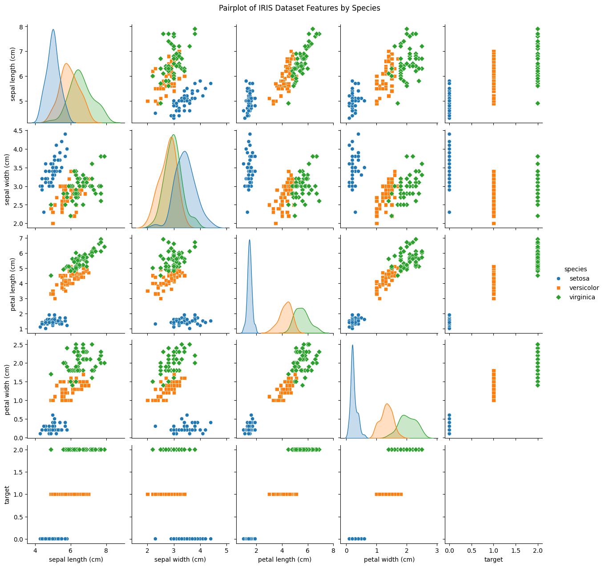
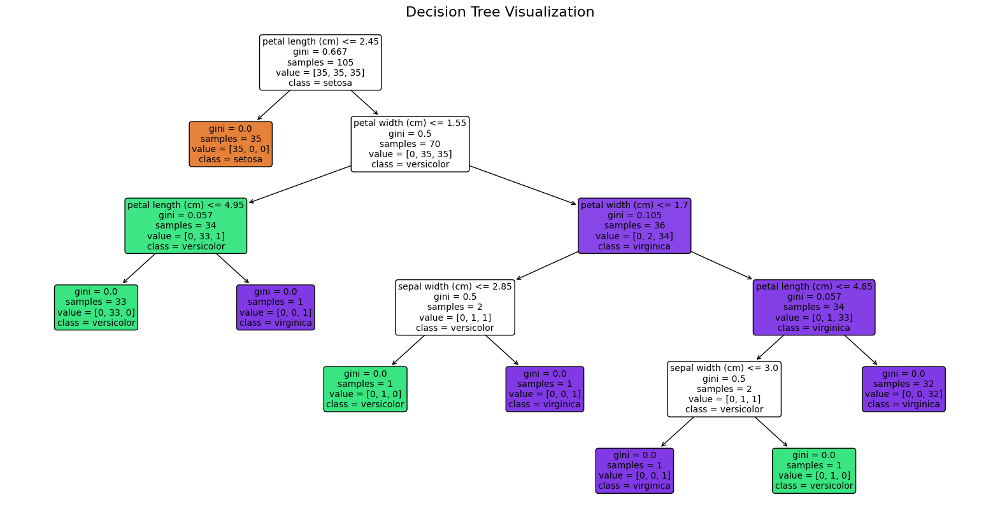
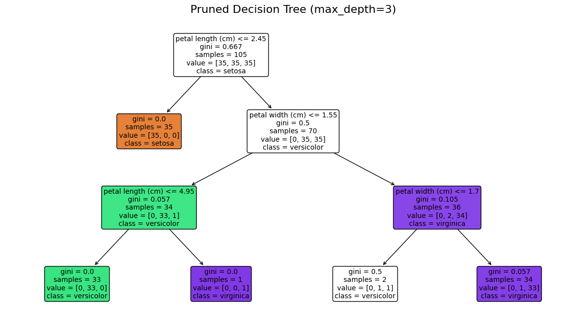

```python
#!/usr/bin/env python
# coding: utf-8

# # Decision Tree Classification on IRIS Dataset
# 
# This notebook demonstrates how to implement a decision tree classifier on the famous IRIS dataset.
# We'll cover:
# 1. Loading and exploring the dataset
# 2. Splitting the data into training and testing sets
# 3. Training a decision tree classifier
# 4. Visualizing the decision tree
# 5. Evaluating the model and printing all parameters

# ## 1. Import necessary libraries

import numpy as np
import pandas as pd
import matplotlib.pyplot as plt
import seaborn as sns
from sklearn.datasets import load_iris
from sklearn.model_selection import train_test_split
from sklearn.tree import DecisionTreeClassifier
from sklearn.metrics import classification_report, confusion_matrix, accuracy_score
from sklearn import tree
import graphviz
from IPython.display import display

# Set random seed for reproducibility
np.random.seed(42)


```


```python
# ## 2. Load and explore the IRIS dataset

# Load the iris dataset
iris = load_iris()
X = iris.data
y = iris.target
feature_names = iris.feature_names
target_names = iris.target_names

# Convert to DataFrame for easier exploration
iris_df = pd.DataFrame(data=X, columns=feature_names)
iris_df['target'] = y
iris_df['species'] = iris_df['target'].apply(lambda x: target_names[x])

# Display the first few rows of the dataset
print("First 5 rows of the IRIS dataset:")
print(iris_df.head())

# Basic dataset information
print("\nBasic dataset information:")
print(f"Number of samples: {X.shape[0]}")
print(f"Number of features: {X.shape[1]}")
print(f"Features: {feature_names}")
print(f"Target classes: {target_names}")
print(f"Class distribution: {np.bincount(y)}")
```

    First 5 rows of the IRIS dataset:
       sepal length (cm)  sepal width (cm)  petal length (cm)  petal width (cm)  \
    0                5.1               3.5                1.4               0.2   
    1                4.9               3.0                1.4               0.2   
    2                4.7               3.2                1.3               0.2   
    3                4.6               3.1                1.5               0.2   
    4                5.0               3.6                1.4               0.2   
    
       target species  
    0       0  setosa  
    1       0  setosa  
    2       0  setosa  
    3       0  setosa  
    4       0  setosa  
    
    Basic dataset information:
    Number of samples: 150
    Number of features: 4
    Features: ['sepal length (cm)', 'sepal width (cm)', 'petal length (cm)', 'petal width (cm)']
    Target classes: ['setosa' 'versicolor' 'virginica']
    Class distribution: [50 50 50]


```python
# ## 3. Visualize the dataset

# Pairplot to visualize relationships between features
plt.figure(figsize=(12, 10))
sns.pairplot(iris_df, hue='species', markers=["o", "s", "D"])
plt.suptitle("Pairplot of IRIS Dataset Features by Species", y=1.02)
plt.show()

```


    <Figure size 1200x1000 with 0 Axes>


    

    


```python


# ## 4. Split the data into training and testing sets

X_train, X_test, y_train, y_test = train_test_split(X, y, test_size=0.3, random_state=42, stratify=y)

print(f"Training set size: {X_train.shape[0]} samples")
print(f"Testing set size: {X_test.shape[0]} samples")

# ## 5. Train a Decision Tree Classifier

# Initialize the classifier
dt_classifier = DecisionTreeClassifier(random_state=42)

# Train the model
dt_classifier.fit(X_train, y_train)

# ## 6. Visualize the Decision Tree

plt.figure(figsize=(20, 10))
tree.plot_tree(dt_classifier, feature_names=feature_names, class_names=target_names, 
               filled=True, rounded=True, fontsize=10)
plt.title("Decision Tree Visualization", fontsize=16)
plt.show()

# For a more detailed visualization using graphviz
dot_data = tree.export_graphviz(dt_classifier, out_file=None, 
                                feature_names=feature_names,  
                                class_names=target_names,
                                filled=True, rounded=True,  
                                special_characters=True)
graph = graphviz.Source(dot_data)
# Uncomment to save the visualization as a PDF
# graph.render("iris_decision_tree", format="pdf")
display(graph)


```

    Training set size: 105 samples
    Testing set size: 45 samples


    

    


    ---------------------------------------------------------------------------

    FileNotFoundError                         Traceback (most recent call last)

    File ~\AppData\Local\Programs\Python\Python311\Lib\site-packages\graphviz\backend\execute.py:76, in run_check(cmd, input_lines, encoding, quiet, **kwargs)
         75         kwargs['stdout'] = kwargs['stderr'] = subprocess.PIPE
    ---> 76     proc = _run_input_lines(cmd, input_lines, kwargs=kwargs)
         77 else:


    File ~\AppData\Local\Programs\Python\Python311\Lib\site-packages\graphviz\backend\execute.py:96, in _run_input_lines(cmd, input_lines, kwargs)
         95 def _run_input_lines(cmd, input_lines, *, kwargs):
    ---> 96     popen = subprocess.Popen(cmd, stdin=subprocess.PIPE, **kwargs)
         98     stdin_write = popen.stdin.write


    File ~\AppData\Local\Programs\Python\Python311\Lib\subprocess.py:1026, in Popen.__init__(self, args, bufsize, executable, stdin, stdout, stderr, preexec_fn, close_fds, shell, cwd, env, universal_newlines, startupinfo, creationflags, restore_signals, start_new_session, pass_fds, user, group, extra_groups, encoding, errors, text, umask, pipesize, process_group)
       1023             self.stderr = io.TextIOWrapper(self.stderr,
       1024                     encoding=encoding, errors=errors)
    -> 1026     self._execute_child(args, executable, preexec_fn, close_fds,
       1027                         pass_fds, cwd, env,
       1028                         startupinfo, creationflags, shell,
       1029                         p2cread, p2cwrite,
       1030                         c2pread, c2pwrite,
       1031                         errread, errwrite,
       1032                         restore_signals,
       1033                         gid, gids, uid, umask,
       1034                         start_new_session, process_group)
       1035 except:
       1036     # Cleanup if the child failed starting.


    File ~\AppData\Local\Programs\Python\Python311\Lib\subprocess.py:1538, in Popen._execute_child(self, args, executable, preexec_fn, close_fds, pass_fds, cwd, env, startupinfo, creationflags, shell, p2cread, p2cwrite, c2pread, c2pwrite, errread, errwrite, unused_restore_signals, unused_gid, unused_gids, unused_uid, unused_umask, unused_start_new_session, unused_process_group)
       1537 try:
    -> 1538     hp, ht, pid, tid = _winapi.CreateProcess(executable, args,
       1539                              # no special security
       1540                              None, None,
       1541                              int(not close_fds),
       1542                              creationflags,
       1543                              env,
       1544                              cwd,
       1545                              startupinfo)
       1546 finally:
       1547     # Child is launched. Close the parent's copy of those pipe
       1548     # handles that only the child should have open.  You need
       (...)
       1551     # pipe will not close when the child process exits and the
       1552     # ReadFile will hang.


    FileNotFoundError: [WinError 2] The system cannot find the file specified

    
    The above exception was the direct cause of the following exception:


    ExecutableNotFound                        Traceback (most recent call last)

    File ~\AppData\Local\Programs\Python\Python311\Lib\site-packages\IPython\core\formatters.py:977, in MimeBundleFormatter.__call__(self, obj, include, exclude)
        974     method = get_real_method(obj, self.print_method)
        976     if method is not None:
    --> 977         return method(include=include, exclude=exclude)
        978     return None
        979 else:


    File ~\AppData\Local\Programs\Python\Python311\Lib\site-packages\graphviz\jupyter_integration.py:98, in JupyterIntegration._repr_mimebundle_(self, include, exclude, **_)
         96 include = set(include) if include is not None else {self._jupyter_mimetype}
         97 include -= set(exclude or [])
    ---> 98 return {mimetype: getattr(self, method_name)()
         99         for mimetype, method_name in MIME_TYPES.items()
        100         if mimetype in include}


    File ~\AppData\Local\Programs\Python\Python311\Lib\site-packages\graphviz\jupyter_integration.py:98, in <dictcomp>(.0)
         96 include = set(include) if include is not None else {self._jupyter_mimetype}
         97 include -= set(exclude or [])
    ---> 98 return {mimetype: getattr(self, method_name)()
         99         for mimetype, method_name in MIME_TYPES.items()
        100         if mimetype in include}


    File ~\AppData\Local\Programs\Python\Python311\Lib\site-packages\graphviz\jupyter_integration.py:112, in JupyterIntegration._repr_image_svg_xml(self)
        110 def _repr_image_svg_xml(self) -> str:
        111     """Return the rendered graph as SVG string."""
    --> 112     return self.pipe(format='svg', encoding=SVG_ENCODING)


    File ~\AppData\Local\Programs\Python\Python311\Lib\site-packages\graphviz\piping.py:104, in Pipe.pipe(self, format, renderer, formatter, neato_no_op, quiet, engine, encoding)
         55 def pipe(self,
         56          format: typing.Optional[str] = None,
         57          renderer: typing.Optional[str] = None,
       (...)
         61          engine: typing.Optional[str] = None,
         62          encoding: typing.Optional[str] = None) -> typing.Union[bytes, str]:
         63     """Return the source piped through the Graphviz layout command.
         64 
         65     Args:
       (...)
        102         '<?xml version='
        103     """
    --> 104     return self._pipe_legacy(format,
        105                              renderer=renderer,
        106                              formatter=formatter,
        107                              neato_no_op=neato_no_op,
        108                              quiet=quiet,
        109                              engine=engine,
        110                              encoding=encoding)


    File ~\AppData\Local\Programs\Python\Python311\Lib\site-packages\graphviz\_tools.py:171, in deprecate_positional_args.<locals>.decorator.<locals>.wrapper(*args, **kwargs)
        162     wanted = ', '.join(f'{name}={value!r}'
        163                        for name, value in deprecated.items())
        164     warnings.warn(f'The signature of {func.__name__} will be reduced'
        165                   f' to {supported_number} positional args'
        166                   f' {list(supported)}: pass {wanted}'
        167                   ' as keyword arg(s)',
        168                   stacklevel=stacklevel,
        169                   category=category)
    --> 171 return func(*args, **kwargs)


    File ~\AppData\Local\Programs\Python\Python311\Lib\site-packages\graphviz\piping.py:121, in Pipe._pipe_legacy(self, format, renderer, formatter, neato_no_op, quiet, engine, encoding)
        112 @_tools.deprecate_positional_args(supported_number=2)
        113 def _pipe_legacy(self,
        114                  format: typing.Optional[str] = None,
       (...)
        119                  engine: typing.Optional[str] = None,
        120                  encoding: typing.Optional[str] = None) -> typing.Union[bytes, str]:
    --> 121     return self._pipe_future(format,
        122                              renderer=renderer,
        123                              formatter=formatter,
        124                              neato_no_op=neato_no_op,
        125                              quiet=quiet,
        126                              engine=engine,
        127                              encoding=encoding)


    File ~\AppData\Local\Programs\Python\Python311\Lib\site-packages\graphviz\piping.py:149, in Pipe._pipe_future(self, format, renderer, formatter, neato_no_op, quiet, engine, encoding)
        146 if encoding is not None:
        147     if codecs.lookup(encoding) is codecs.lookup(self.encoding):
        148         # common case: both stdin and stdout need the same encoding
    --> 149         return self._pipe_lines_string(*args, encoding=encoding, **kwargs)
        150     try:
        151         raw = self._pipe_lines(*args, input_encoding=self.encoding, **kwargs)


    File ~\AppData\Local\Programs\Python\Python311\Lib\site-packages\graphviz\backend\piping.py:212, in pipe_lines_string(engine, format, input_lines, encoding, renderer, formatter, neato_no_op, quiet)
        206 cmd = dot_command.command(engine, format,
        207                           renderer=renderer,
        208                           formatter=formatter,
        209                           neato_no_op=neato_no_op)
        210 kwargs = {'input_lines': input_lines, 'encoding': encoding}
    --> 212 proc = execute.run_check(cmd, capture_output=True, quiet=quiet, **kwargs)
        213 return proc.stdout


    File ~\AppData\Local\Programs\Python\Python311\Lib\site-packages\graphviz\backend\execute.py:81, in run_check(cmd, input_lines, encoding, quiet, **kwargs)
         79 except OSError as e:
         80     if e.errno == errno.ENOENT:
    ---> 81         raise ExecutableNotFound(cmd) from e
         82     raise
         84 if not quiet and proc.stderr:


    ExecutableNotFound: failed to execute WindowsPath('dot'), make sure the Graphviz executables are on your systems' PATH


    <graphviz.sources.Source at 0x251dde457d0>


```python
# ## 7. Make predictions and evaluate the model

y_pred = dt_classifier.predict(X_test)

# Print model parameters
print("\nDecision Tree Parameters:")
print(f"Criterion: {dt_classifier.criterion}")
print(f"Splitter: {dt_classifier.splitter}")
print(f"Max Depth: {dt_classifier.max_depth}")
print(f"Min Samples Split: {dt_classifier.min_samples_split}")
print(f"Min Samples Leaf: {dt_classifier.min_samples_leaf}")
print(f"Max Features: {dt_classifier.max_features}")
print(f"Tree Depth: {dt_classifier.get_depth()}")
print(f"Number of Leaves: {dt_classifier.get_n_leaves()}")
print(f"Feature Importances: {dt_classifier.feature_importances_}")

# Print feature importance with feature names
feature_importance = pd.DataFrame({
    'Feature': feature_names,
    'Importance': dt_classifier.feature_importances_
}).sort_values('Importance', ascending=False)

print("\nFeature Importance:")
print(feature_importance)


```

    
    Decision Tree Parameters:
    Criterion: gini
    Splitter: best
    Max Depth: None
    Min Samples Split: 2
    Min Samples Leaf: 1
    Max Features: None
    Tree Depth: 5
    Number of Leaves: 8
    Feature Importances: [0.         0.02857143 0.54117647 0.4302521 ]
    
    Feature Importance:
                 Feature  Importance
    2  petal length (cm)    0.541176
    3   petal width (cm)    0.430252
    1   sepal width (cm)    0.028571
    0  sepal length (cm)    0.000000


```python
# ## 8. Evaluate model performance

print("\nModel Evaluation:")
print(f"Accuracy: {accuracy_score(y_test, y_pred):.4f}")

print("\nClassification Report:")
print(classification_report(y_test, y_pred, target_names=target_names))

print("\nConfusion Matrix:")
cm = confusion_matrix(y_test, y_pred)
plt.figure(figsize=(8, 6))
sns.heatmap(cm, annot=True, fmt='d', cmap='Blues', 
            xticklabels=target_names, 
            yticklabels=target_names)
plt.xlabel('Predicted Labels')
plt.ylabel('True Labels')
plt.title('Confusion Matrix')
plt.show()


```

    
    Model Evaluation:
    Accuracy: 0.9333
    
    Classification Report:
                  precision    recall  f1-score   support
    
          setosa       1.00      1.00      1.00        15
      versicolor       1.00      0.80      0.89        15
       virginica       0.83      1.00      0.91        15
    
        accuracy                           0.93        45
       macro avg       0.94      0.93      0.93        45
    weighted avg       0.94      0.93      0.93        45
    
    
    Confusion Matrix:


    

    


```python
# ## 9. Try different parameters to improve the model

# Let's create a decision tree with controlled depth to avoid overfitting
dt_pruned = DecisionTreeClassifier(max_depth=3, random_state=42)
dt_pruned.fit(X_train, y_train)

# Visualize the pruned tree
plt.figure(figsize=(15, 8))
tree.plot_tree(dt_pruned, feature_names=feature_names, class_names=target_names, 
               filled=True, rounded=True, fontsize=10)
plt.title("Pruned Decision Tree (max_depth=3)", fontsize=16)
plt.show()

# Evaluate the pruned model
y_pred_pruned = dt_pruned.predict(X_test)
print("\nPruned Decision Tree Evaluation:")
print(f"Accuracy: {accuracy_score(y_test, y_pred_pruned):.4f}")
print("\nClassification Report (Pruned Tree):")
print(classification_report(y_test, y_pred_pruned, target_names=target_names))


```


    

    


    
    Pruned Decision Tree Evaluation:
    Accuracy: 0.9778
    
    Classification Report (Pruned Tree):
                  precision    recall  f1-score   support
    
          setosa       1.00      1.00      1.00        15
      versicolor       1.00      0.93      0.97        15
       virginica       0.94      1.00      0.97        15
    
        accuracy                           0.98        45
       macro avg       0.98      0.98      0.98        45
    weighted avg       0.98      0.98      0.98        45
    


```python
# ## 10. Conclusion

print("\nConclusion:")
print("We have successfully implemented a decision tree classifier on the IRIS dataset.")
print("The model achieved good accuracy in classifying the three species of iris flowers.")
print("We also visualized the decision tree and analyzed feature importance.")
print("The most important features for classification were:", 
      feature_names[np.argmax(dt_classifier.feature_importances_)])
```

    
    Conclusion:
    We have successfully implemented a decision tree classifier on the IRIS dataset.
    The model achieved good accuracy in classifying the three species of iris flowers.
    We also visualized the decision tree and analyzed feature importance.
    The most important features for classification were: petal length (cm)


```python

```
